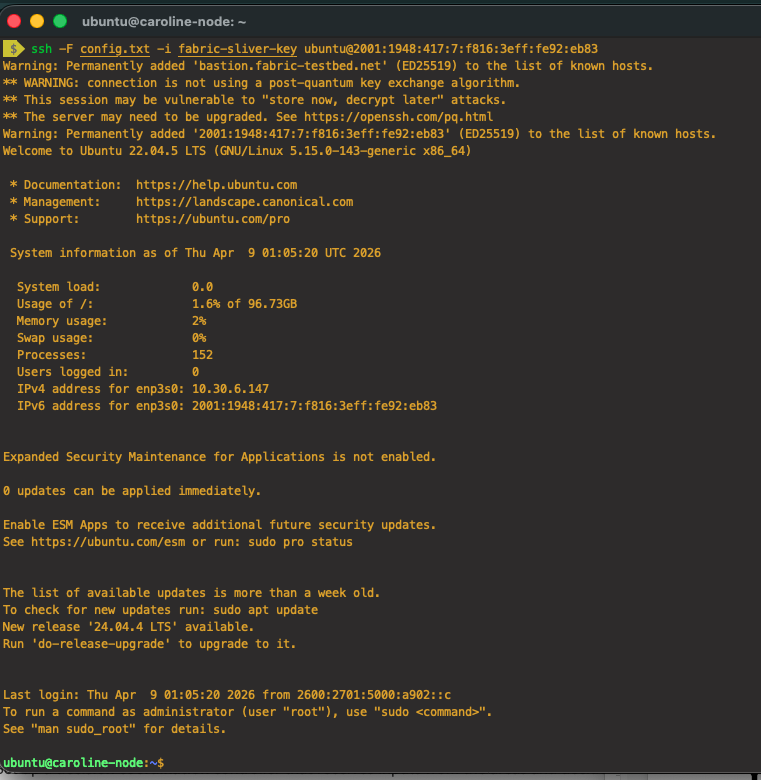

# Submission II – DeepPrep fMRI Preprocessing Pipeline

# Getting setup:
## Part 1: Creating and SSHing into FABRIC VM

Disclaimer: This documentation assumes you have a FABRIC account, you are in the CI4Neuroscience Project, and you have set up a sliver and bastion keys for your account and that you have them locally on your computer. If not, please watch and follow along Ajay's FABRIC setup video from Week 3 on Canvas.

1. Go to FABRIC Portal website here: https://portal.fabric-testbed.net/ and Log in using your umsystem credentials.
2. Click on Experiments in the top navbar and then click Projects & Slices, then click CI4Neuroscience. Then click Slices, and click the Create Slice button.
3. Enter the following node information:

Step 2: Add Nodes Section
* Site: UTAH
* Node Name: major-sub-ii
* Cores: 8
* RAM (GB): 32
* Disk (GB): 100
* OS Image: Ubuntu 20

Step 4: Create Slice Section
* Slice Name: test_slice
* SSH Keys: fabric-sliver-key

Click Create Slice when you are ready. Wait up to 2-3 minutes for the slice to provision.

Once the slice status is Green or StableOk, click the white square which is your node in your topology. Then you should be able to see the SSH Command. Click the copy icon on the SSH Command it and go to a terminal on your computer. It should look something like this, but with your unique hostname:
```
ssh -F <path to SSH config file> -i <path to private sliver key> ubuntu@2001:1948:417:7:f816:3eff:fe92:eb83
```


Navigate to the folder you have your config and private sliver key in. Enter the SSH command and you should be inside the node.


## 📌 Prerequisites / Assumptions

This README assumes the user is already operating inside the `submission_ii/` directory.

All relative paths in commands (e.g., `cd deepprep`, `./run_deepprep.sh`) are based on this working directory.

The following files and folders are expected to exist:

- `deepprep/` (contains `run_deepprep.sh`)
- `data/` (BIDS-formatted dataset)
- `outputs/` (auto-generated during execution)
- `license.txt` (FreeSurfer license file)
## ⚙️ Execution / Reproducibility

To run the DeepPrep preprocessing pipeline, navigate into the DeepPrep directory and execute the provided script:

```bash
cd deepprep
bash run_deepprep.sh