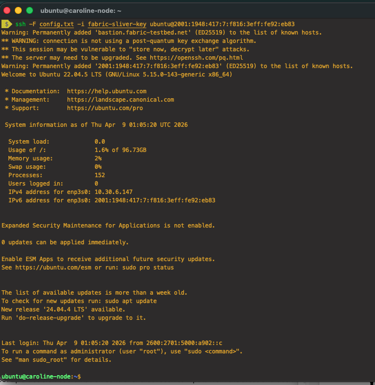

# Final Project – DeepPrep fMRI Preprocessing Pipeline (Submission IV)

# Getting setup:
## Part 0: Following along with this README.md

I would recommend cloning this repository to your local computer to follow along  and access the relevant scripts easily.

Tools used:
- GitHub Desktop - Download link: https://desktop.github.com/download/
- Visual Studio Code - Download link: https://code.visualstudio.com/download


I recommend downloading both of these tools to your computer if you don't already have them. You can clone this repository down to your local computer using GitHub Desktop and then you should be able to open it in Visual Studio Code.

**How to clone a repository from GitHub to GitHub Desktop:**
https://docs.github.com/en/desktop/adding-and-cloning-repositories/cloning-a-repository-from-github-to-github-desktop


## Part 1: Creating and SSHing into FABRIC VM

Disclaimer: This documentation assumes you have a FABRIC account, you are in the CI4Neuroscience Project, and you have set up a sliver and bastion keys for your account and that you have them locally on your computer. If not, please watch and follow along Ajay's FABRIC setup video from Week 3 on Canvas.

1. Go to FABRIC Portal website here: https://portal.fabric-testbed.net/ and Log in using your umsystem credentials.
2. Click on Experiments in the top navbar and then click Projects & Slices, then click CI4Neuroscience. Then click Slices, and click the Create Slice button.
3. Enter the following node information:

Step 2: Add Nodes Section
* Site: UTAH
* Node Name: firstname-node (example: Caroline-node)
* Cores: 8
* RAM (GB): 32
* Disk (GB): 500
* OS Image: Ubuntu 22 

Click Add Node, you should see it pop up in the topology on the right hand side.

Step 4: Create Slice Section
* Slice Name: test_slice
* Lease End Time: 2026-5-15 00:00:00(1 day after final project is due)
* SSH Keys: fabric-sliver-key (or whatever you named your sliver key)

Double check your setup matches this picture and then click Create Slice when you are ready. Wait up to 2-3 minutes for the slice to provision.


Once the slice status is Green or StableOk, click the white square which is your node in your topology. Then you should be able to see the SSH Command. Click the copy icon on the SSH Command it and go to a terminal on your computer. It should look something like this, but with your unique hostname:
```
ssh -F <path to SSH config file> -i <path to private sliver key> ubuntu@2001:1948:417:7:f816:3eff:fe92:eb83
```


Navigate to the folder you have your config and private sliver key in. Enter the SSH command and you should be inside the node.


# Part 2: Installing DeepPrep and Setting up on VM
These instructions are adapted from DeepPrep documentation: https://deepprep.readthedocs.io/en/latest/index.html

## 2.1: Installing Docker on the VM

After successfully SSHing into the FABRIC VM, the next step is to install Docker, which is required to run DeepPrep.


### 2.1.1 Update system packages

```
sudo apt update
sudo apt upgrade -y
```
If it gives you any prompts during the upgrade just press the Enter key until they go away it should finish successfully.

### 2.1.2 Install Docker (recommended method for FABRIC VM)

Since the VM is Ubuntu 22, Docker can be installed directly from the Ubuntu package manager:
```
sudo apt install -y docker.io
```

### 2.1.3 Start and enable Docker service
```
sudo systemctl start docker
sudo systemctl enable docker
```

### 2.1.4 Verify Docker installation

Run the following command to confirm Docker is working correctly:
```
docker run hello-world
```

You should see something like this on success:
```
Unable to find image 'hello-world:latest' locally
latest: Pulling from library/hello-world
4f55086f7dd0: Pull complete
d5e71e642bf5: Download complete
Digest: sha256:f9078146db2e05e794366b1bfe584a14ea6317f44027d10ef7dad65279026885
Status: Downloaded newer image for hello-world:latest

Hello from Docker!
This message shows that your installation appears to be working correctly.

To generate this message, Docker took the following steps:
 1. The Docker client contacted the Docker daemon.
 2. The Docker daemon pulled the "hello-world" image from the Docker Hub.
    (amd64)
 3. The Docker daemon created a new container from that image which runs the
    executable that produces the output you are currently reading.
 4. The Docker daemon streamed that output to the Docker client, which sent it
    to your terminal.

To try something more ambitious, you can run an Ubuntu container with:
 $ docker run -it ubuntu bash

Share images, automate workflows, and more with a free Docker ID:
 https://hub.docker.com/

For more examples and ideas, visit:
 https://docs.docker.com/get-started/
```


### 2.1.5 Fixing Docker Permission Denied Error

After installing Docker, you may encounter the following error when running a Docker command:

```
permission denied while trying to connect to the Docker daemon socket
```

This occurs because the current user does not have permission to access the Docker daemon.

### Temporary fix (recommended for immediate use)

Use sudo to run Docker commands:

```
sudo docker run hello-world
```

This allows Docker to run without changing system permissions.

### Permanent fix (recommended setup)

To allow Docker to run without sudo, add your user to the Docker group:
```
sudo usermod -aG docker $USER
```
Apply the group changes immediately:
```
newgrp docker
```
Then verify Docker works without sudo:
```
docker run hello-world
```

## 2.2 Pulling and Testing the DeepPrep Docker Image

After Docker has been installed and verified on the VM, the next step is to download and test the DeepPrep container.

---

### 2.2.1 Pull the DeepPrep Docker image

Run the following command to download the DeepPrep image from DockerHub:

```
docker pull pbfslab/deepprep:25.1.0
```

The DeepPrep image can take up to 4 minutes to pull down since it is big.

### 2.2.2 Run the Docker image (test execution)
To verify that the container is functioning correctly, run:
```
docker run --rm pbfslab/deepprep:25.1.0
```

### 2.2.3 Expected output

If the image was successfully pulled and executed, the terminal should display usage information similar to the following. It may take up to 30 seconds to show this. You can press Ctrl + C multiple times to kill it once you see that it is working.
```
ubuntu@caroline-node:~$ docker run --rm pbfslab/deepprep:25.1.0
INFO: args:
2026-05-06 01:21:42.189 Did not auto detect external IP.
Please go to https://docs.streamlit.io/ for debugging hints.

  You can now view your Streamlit app in your browser.

  Local URL: http://localhost:8501
  Network URL: http://172.17.0.3:8501

^C^C^C
got 3 SIGTERM/SIGINTs, forcefully exiting
ubuntu@caroline-node:~$
```                
## 2.3 Running DeepPrep on the FABRIC VM

Once Docker is installed (Section 2.1) and the DeepPrep image has been successfully pulled and verified (Section 2.2), you are ready to run the preprocessing pipeline on the VM.

This project uses a wrapper script (run_deepprep.sh) to simplify execution of the DeepPrep Docker container on FABRIC.

## 📦 Dataset Strategy (ds005237)

The dataset is https://openneuro.org/datasets/ds005237/versions/1.0.3 from OpenNeuro. Alternatively you can view it on GitHub here: https://github.com/OpenNeuroDatasets/ds005237.git.

The full ds005237 dataset is large and will NOT be fully downloaded or processed on FABRIC due to compute and storage constraints.

Instead, we use a subset-based workflow:

* Each team member processes assigned subjects only
* Subjects are downloaded individually from OpenNeuro (or S3)
* Each subject is run independently using DeepPrep

Example:

sub-NDARINVAG023WG3

sub-NDARINVAG339WHH

sub-NDARINV...

Each participant is run individually using:

`./run_deepprep.sh <participant_id>`

## 👥 Subject Assignment (Team Use Only)

To keep processing organized, each team member is responsible for a subset of participants.

Caroline:
- sub-NDARINVAG023WG3
- sub-NDARINVAG339WHH
- sub-NDARINVZX212UNE

Noor:
- sub-NDARINVUR466KN5
- sub-NDARINVJP343BJ6
- sub-NDARINVFH503ZWA

Scott:
- sub-NDARINVKX727WL8
- sub-NDARINVUY799LKJ
- sub-NDARINVWD338PY2

#### 📌 Execution rule

Each team member is responsible for:

* editing download_subjects.sh
* inserting their assigned subject IDs
* running the script to populate data/ds005237/

This ensures no overlap and reproducible subject-level processing.

### 2.3.1 📦 Dataset Acquisition Strategy (ds005237)

We use AWS CLI (via OpenNeuro S3 mirror when available) to populate ~/deepprep_project/data/ds005237/ with only the assigned subjects for each team member. This avoids downloading the full dataset.

#### ⚙️ Step 1: Install AWS CLI (if not already installed)
```
sudo apt install -y awscli
```
#### 📁 Step 2: Create download script on the VM

Inside your project directory:
```
mkdir -p ~/deepprep_project/scripts
cd ~/deepprep_project/scripts
vi download_subjects.sh
```

Ubuntu offers a variety of terminal-based text editors ranging from beginner-friendly tools to highly complex, extensible environments. GNU Nano and Vim are usually pre-installed and are the most common choices for command-line editing. This documentation uses `vi` mostly but you can use `nano` if you want too.

How to use vi: https://www.redhat.com/en/blog/introduction-vi-editor

How to use Nano: https://linuxize.com/post/how-to-use-nano-text-editor/

All of the scripts we plan to use are in this submission_iv folder in the scripts folder. This includes
`download_subjects.sh`, `run_all_subjects.sh`, `run_deepprep.sh`.

Paste the template found in this repository called `download_subjects.sh`. Update the `SUBJECTS` array to include your specific assigned subjects.

#### ▶️ Step 3: Make it executable
```
chmod +x download_subjects.sh
```

#### ▶️ Step 4: Run download
```
./download_subjects.sh
```

To download 3 subjects it could take up to 3 minutes or so. You should see the 3 subjects downloaded as well as a `dataset_description.json`.
```
Verifying dataset structure:
dataset_description.json  sub-NDARINVAG023WG3  sub-NDARINVAG339WHH  sub-NDARINVZX212UNE
Download complete.
```

## 2.3.2 Requirements (license + assumptions)

### 🔑 FreeSurfer License Setup

DeepPrep requires a valid FreeSurfer license to run preprocessing steps.

If you do not already have one, you can obtain it for free by registering here:

👉 https://surfer.nmr.mgh.harvard.edu/registration.html


### 📁 Place the license on the VM

After downloading, copy your license file into the project directory:

```
mkdir -p ~/deepprep_project/license
cd ~/deepprep_project/license
vi license.txt
```
Copy the license.txt content from your local computer into this empty license.txt file you created.

### 🧠 Why this is required

DeepPrep uses FreeSurfer internally for:

* anatomical reconstruction
* surface registration
* segmentation steps

Without a valid license, the pipeline will fail during preprocessing.

### 📌 How it is used in Docker

The license is mounted into the container:

`-v $FS_LICENSE:/fs_license.txt`

Inside the container, DeepPrep expects:

`/fs_license.txt`


### ⚠️ Important note (this is where students usually mess up)

Make sure:

* the file is named exactly license.txt
* it is not empty
* it is readable:

```
chmod 644 ~/deepprep_project/license/license.txt`
```

## 2.3.3 📁 VM Folder Setup

After downloading the test dataset, organize your workspace on the VM as follows. For the 3 scripts, they exist here in the repo you just need to create blank files on the node and copy the contents from your local to node: 

```
mkdir ~/deepprep_project/output
cd ~/deepprep_project/scripts
vi run_deepprep.sh
vi run_all_subjects.sh
vi cleanup.sh
```
Make sure your scripts are executable:
```
chmod +x ~/deepprep_project/scripts/run_deepprep.sh
chmod +x ~/deepprep_project/scripts/run_all_subjects.sh
chmod +x ~/deepprep_project/scripts/cleanup.sh
```


On the FABRIC VM, we maintain a clean BIDS-style project directory:
```
~/deepprep_project/
├── data/
│   └── ds005237/
│       ├── sub-1XXXXX/
│       ├── sub-2XXXXX/
│       ├── sub-3XXXXX/
|       └── dataset_description.json
├── output/
├── license/
│   └── license.txt
├── scripts/
│   ├── run_deepprep.sh
│   ├── download_subjects.sh
|   ├── run_all_subjects.sh
|   └── cleanup.sh

```

### 📌 Key design principles

* data/ → only raw BIDS inputs (ds005237 subset)
* output/ → all DeepPrep derivatives
* license/ → FreeSurfer license only
* scripts/ → all reproducible automation (no manual commands)

Verify setup with tree:
```
sudo apt install tree
tree ~/deepprep_project/
```

## ▶️ 2.3.5 Running DeepPrep

Run the pipeline:
```
cd ~/deepprep_project/scripts
./run_deepprep.sh sub-NDARINVXXXX
```
You must pass a participant ID from ds005237 (e.g., sub-NDARINVAG023WG3).

## 🔄 2.3.5.1 Running DeepPrep Asynchronously (tmux)

DeepPrep jobs can take a long time to complete. To avoid interruption when closing your terminal or losing SSH connection, we use `tmux` to run jobs in a persistent session.

🧠 The core idea

When you run something normally:
```
ssh → run command → close laptop → process dies 😭
```
With tmux:
```
ssh → start tmux session → run command → disconnect → process keeps running ✅
```
Because the process lives inside tmux, not inside your SSH connection.

### 📦 Install tmux (if not installed)
```
sudo apt install -y tmux
```
### ▶️ Start a tmux session
```
tmux new -s deepprep
```
You are now inside a persistent session.

### ▶️ Run your pipeline
```
./run_deepprep.sh sub-NDARINVXXXX
```

or 
```
./run_all_subjects.sh
```

From within the scripts folder.
### ⏹️ Detach from session (leave it running)

Press:
```
Ctrl + B, then D
```

This safely exits the session while keeping the job running in the background.
Now:

* Your job is STILL running
* You are no longer viewing it

### 🔗 Attach = “come back later”

You reconnect to your node and want to resume watching:
```
tmux attach -t deepprep
```

Now:

* You’re back exactly where you left off
* Same logs, same progress, same screen

### 📌 Why this is important

* Prevents job loss if SSH disconnects
* Allows long-running jobs overnight
* Enables “set and forget” execution

### 🔍 Helpful commands
List sessions:
```
tmux ls
```
Attach to one:
```
tmux attach -t deepprep
```
Kill session (when done):
```
tmux kill-session -t deepprep
```

## ⚙️ 2.3.6 What the Script Does

The run_deepprep.sh script:

* Validates BIDS dataset structure for ds005237
* Checks FreeSurfer license
* Accepts participant ID as input (ds005237 subject IDs)
* Mounts dataset + output directories into Docker
* Runs DeepPrep preprocessing pipeline on selected subject
* Enables:
  - Susceptibility Distortion Correction (SDC)
  - Motion/Nuisance confound regression outputs
* Outputs results to:
  
```
~/deepprep_project/output/
```
This pipeline processes selected participants from ds005237 (OpenNeuro Transdiagnostic Connectome Project). Only specified subjects are processed to reduce compute cost and allow multi-person analysis across teammates.

## 🔁 2.3.6.1 Running Multiple Subjects Automatically

Instead of manually running DeepPrep for each subject, we provide a batch script to process multiple participants sequentially.

### ▶️ Run batch processing
```
./run_all_subjects.sh
```
### 📌 Behavior

* Runs subjects one at a time
* Automatically proceeds to next subject after completion
* Ideal when using a single FABRIC node

### ⚠️ Important

Do NOT run multiple DeepPrep jobs simultaneously on the same node unless you have sufficient CPU/RAM — this can cause crashes.

For parallel processing, use multiple FABRIC nodes instead.

## 📌 2.3.7 Expected Output

If successful, DeepPrep will generate:

* Preprocessed anatomical outputs
* Preprocessed BOLD fMRI outputs
* Susceptibility Distortion Corrected (SDC) data
* Motion and nuisance regression confound outputs
* QC reports and derivatives

Output will be stored in:
```
~/deepprep_project/output/
```

If anything goes wrong during the DeepPrep execution, you can run
```
./cleanup.sh
```
To reset the output folder so it is easy to rerun DeepPrep.

## ⏱️ Runtime Considerations

DeepPrep is a computationally intensive neuroimaging preprocessing pipeline. Execution time depends on available CPU resources, memory allocation, and dataset size.

For the single-subject BIDS test dataset used in this project, runtime on a CPU-based FABRIC VM is expected to be on the order of tens of minutes to a few hours.

The pipeline is executed as a multi-stage workflow (Nextflow-based), meaning:

* Progress is not strictly linear
* Some stages may complete quickly while others take significantly longer
* The terminal output may appear static for extended periods while long-running tasks execute in the background

This behavior is expected and does not indicate failure.

## 🔍 Monitoring Execution

Once the pipeline is running, progress can be monitored through a separate SSH session without interfering with execution. This is useful for long-running workflows where updates are intermittent.

Check active processes

`ps aux | grep deepprep`

Monitor system resource usage

`top`

Inspect output directory growth

`ls -lh ~/deepprep_project/output`

Continuous monitoring (recommended)

`watch -n 10 ls -lh ~/deepprep_project/output`

What each part means

* watch
    Runs a command repeatedly and refreshes the screen.
* -n 10
    Refresh every 10 seconds
* ls -lh ~/deepprep_project/output
    Lists files in your output folder in:
    * -l → detailed format (permissions, size, time)
    * -h → human-readable sizes (KB, MB, GB)

How to stop it

Just press:

`Ctrl + C`

These checks help confirm that the pipeline is actively running even if the log output in the primary terminal appears unchanged for a period of time.

## 📊 2.3.8 Collecting and Verifying Results

After pipeline completion, the primary outputs used for submission are located in:

`~/deepprep_project/output/QC/`

where QC stands for Quality control.

### 📁 Key deliverables

The following files are used to evaluate successful execution:

- `report.html` → primary QC report summarizing preprocessing results
- `timeline.html` → execution timeline and workflow breakdown
- `dataset_description.json` → dataset metadata

### 🧪 Verification steps

A successful run is confirmed by:

- Presence of completed QC HTML reports
- No failed or running processes in terminal output
- Final message indicating successful pipeline completion (e.g., “DeepPrep completed successfully”)
- Output directory populated with subject results

### 📌 Optional evidence

For documentation purposes, the following may also be included:

- Screenshot of `tree ~/deepprep_project/output`
- Screenshot of successful completion log
- QC report HTML opened in browser

## 📤 2.3.9 Exporting and Combining Processed Data

After preprocessing, each team member must export their results so the full dataset can be combined for analysis.

### 🎯 Goal

Each team member processes 3 subjects → combine into 9-subject dataset for analysis (e.g., Google Colab notebooks).

---

## 🖥️ Download processed output to local computer and upload to Shared Google Drive

### Step 1: Compress output
```
cd ~/deepprep_project/
tar -czvf output.tar.gz output/
```

### Step 2: Copy to local machine
Run this from your **local computer terminal**:
```
scp -i <path_to_key> ubuntu@<fabric_ip>:~/deepprep_project/output.tar.gz .
```
### Step 3: Upload to shared storage

Upload to:
* Google Drive (Shared Folder, CS_4001_Colabs/Final_Project/combined_outputs)

### 🧠 Final Dataset Assembly

One team member (or all members) should:

1. Download all outputs
2. Extract them:

```
tar -xzvf output.tar.gz
```
3. Combine into a single directory:
```
combined_outputs/
├── sub-XXX/
├── sub-YYY/
├── sub-ZZZ/
```